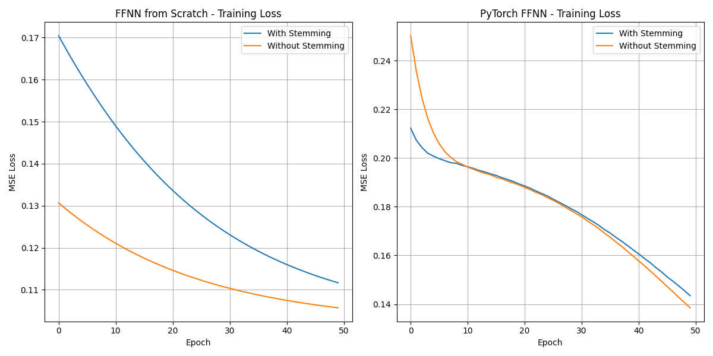

# 💬 Sentiment Classification using FFNNs: NumPy vs PyTorch

This project compares two Feedforward Neural Networks (FFNNs) for classifying airline tweets into **positive** or **negative** sentiment:
- One implemented **from scratch using NumPy**
- Another built using **PyTorch’s neural network module**

---

## ✈️ Project Overview

The goal is to build binary classifiers to detect sentiment polarity in tweets using TF-IDF vector representations. We experiment with:
- Preprocessing: with and without stemming
- Model architecture: same structure, different frameworks
- Evaluation: accuracy and confusion matrices

---

## 🧠 Models Implemented

| Model Type     | Preprocessing      | Optimizer | Accuracy | Notes |
|----------------|--------------------|-----------|----------|-------|
| NumPy FFNN     | With Stemming      | SGD       | 71.74%   | Predicts only majority class |
| NumPy FFNN     | Without Stemming   | SGD       | 71.74%   | No gain despite vocab change |
| PyTorch FFNN   | With Stemming      | Adam      | 75.49%   | Balanced but underperforms |
| PyTorch FFNN   | Without Stemming   | Adam      | **76.71%** | Best results across all |

➡️ PyTorch models were more effective at handling positive sentiment examples.

---

## 📉 Training Loss Curves



Left: NumPy FFNN — Right: PyTorch FFNN  
Both models show consistent loss reduction, with PyTorch converging faster.

---

## 📊 Dataset Summary

- Airline sentiment tweets
- Training: 4183 samples  
- Testing: 4182 samples  
- Classes: `positive` or `negative`

---

## ⚙️ Configuration & Hyperparameters

| Parameter       | Value                     |
|-----------------|---------------------------|
| Hidden Units    | 20                        |
| Epochs          | 50                        |
| Batch Size      | 32                        |
| Loss Function   | MSE                       |
| Optimizers      | SGD (NumPy), Adam (PyTorch) |
| Preprocessing   | With/Without stemming     |

---

## 📂 Files in This Repository

| File | Description |
|------|-------------|
| `FFNN.ipynb` | Final Jupyter Notebook |
| `Airline Tweet Sentiment Classification Report.docx` | Formal write-up of methodology and results |
| `Outputs/loss_curves.png` | Training loss comparison (NumPy vs PyTorch) |
| `Outputs/results_comparison.txt` | Confusion matrices and accuracy |
| `Outputs/model_analysis.txt` | Summary and interpretation of model differences |
| `Outputs/ffnn_sentiment_classification_20250228_221701.log` | Full experiment log (optional) |

---

## 💻 Technologies Used

```bash
Python
NumPy
PyTorch
NLTK
Matplotlib

pip install numpy torch nltk matplotlib
