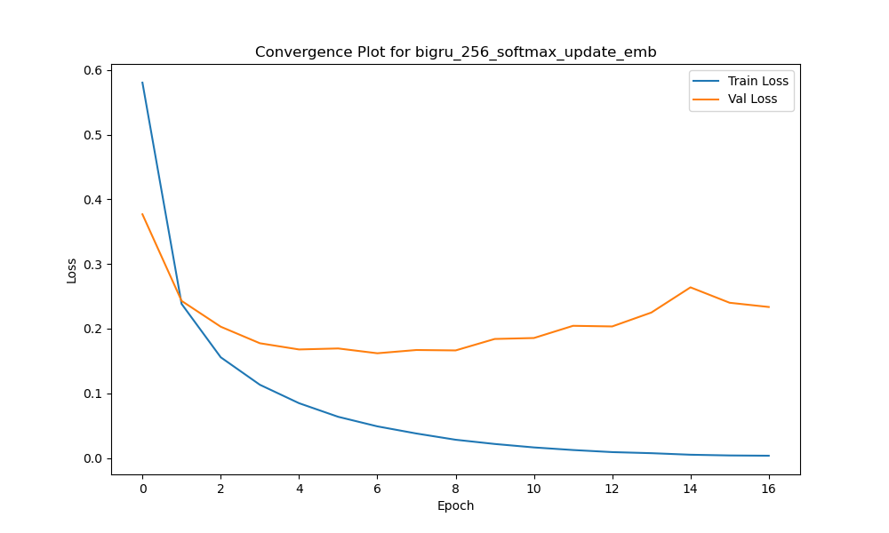
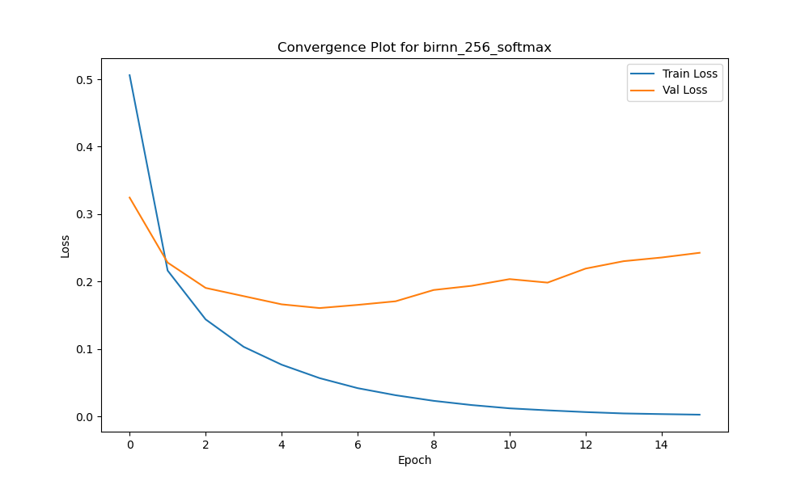
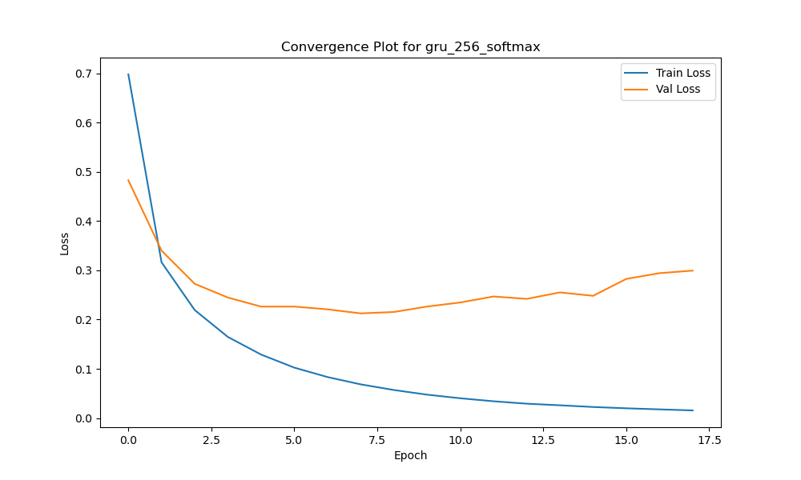
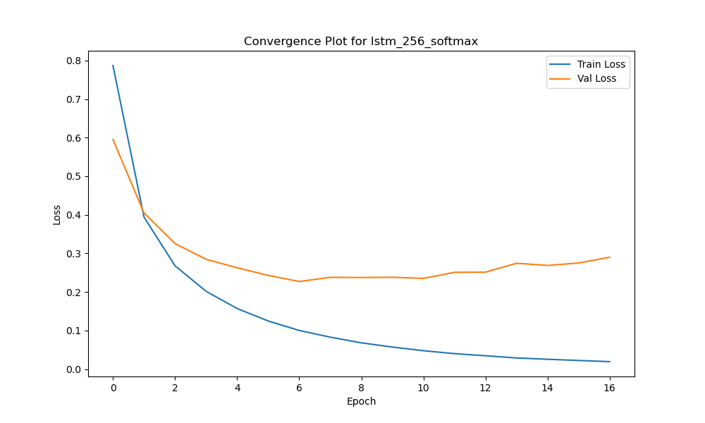

# 🧠 “Tag Me If You Can”: Chasing Entities with RNNs  
*A neural journey into Named Entity Recognition on the CoNLL-2003 dataset*

What if your model could **read like a human** — picking out names, places, and organizations from a messy blob of text? That’s the goal of **Named Entity Recognition (NER)**, and this project is all about training different types of RNNs to master it.

This project explores and compares seven different neural architectures for Named Entity Recognition — each with its own quirks, strengths, and insights. From simple RNNs to advanced BiGRUs with trainable embeddings, the goal was to uncover what really works in sequence labeling.

---

## 🎯 The Mission

> Teach machines to recognize **who**, **where**, and **what** in natural language.

We used the **CoNLL-2003** dataset — a gold standard for NER — and applied a range of **RNN-based models**, from classic vanilla RNNs to advanced BiGRUs with fine-tuned embeddings.

Every model faced the same task: label each word in a sentence with its entity type (like `B-PER`, `I-ORG`, or `O`).

---

## 🧩 The Players: Our 7 Neural Agents

| # | Model Variant                     | Description |
|--:|----------------------------------|-------------|
| 1 | RNN                              | Basic, unidirectional |
| 2 | Bi-RNN                           | Sees context both ways |
| 3 | LSTM                             | Long-term memory savior |
| 4 | Bi-LSTM                          | Combines long-term memory with bidirectionality |
| 5 | GRU                              | Lightweight LSTM cousin |
| 6 | Bi-GRU                           | Fast, bidirectional, powerful |
| 7 | **Bi-GRU + Trainable Embeddings** | ⭐️ Our champion model |

All models used:
- Pretrained **Google Word2Vec** embeddings (300D)
- **256 hidden units**, dropout, and softmax output
- Optimized with **Adam**, `lr = 0.0001`
- BIO-tagged outputs (`B-ORG`, `I-PER`, `O`, etc.)

---

## 🧪 The Trials: Evaluation with CoNLL scorer

Each model was tested on unseen data. Here’s how they performed:

| Model         | Precision | Recall | F1 Score |
|---------------|-----------|--------|----------|
| 🏆 **Bi-GRU + Trainable Embeddings** | 89.21     | 88.76  | **88.98** |
| Bi-LSTM       | 88.45     | 88.12  | 88.28     |
| GRU           | 87.13     | 86.01  | 86.56     |
| RNN           | 84.57     | 83.92  | 84.24     |

BiGRU with updated embeddings crushed the leaderboard — generalizing better and stabilizing faster.

---

## 📉 Loss Chronicles: Convergence Visuals

Every model had its own learning journey. Here's a peek into their progress:

### ⭐️ BiGRU with Trainable Embeddings


### 🔁 Other Runners
| Model | Plot |
|-------|------|
| BiGRU |  |
| BiLSTM |  |
| BiRNN |  |
| GRU   |  |
| LSTM  |  |
| RNN   |  |

---

## 📂 What’s Inside This Repo

| File | Description |
|------|-------------|
| `NER with RNNs.py` | Full implementation of 7 models |
| `Outputs/*.png` | Loss plots for all models |
| `README.md` | This beautiful story you're reading now ✨ |

---

## 🛠 Tech Stack

```bash
Python 3.x
PyTorch
NumPy
Matplotlib

