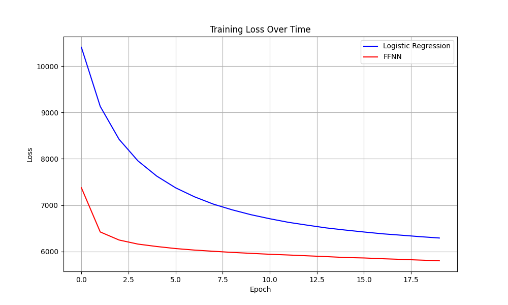
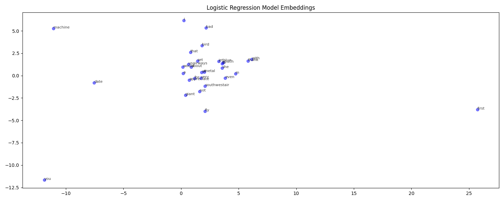
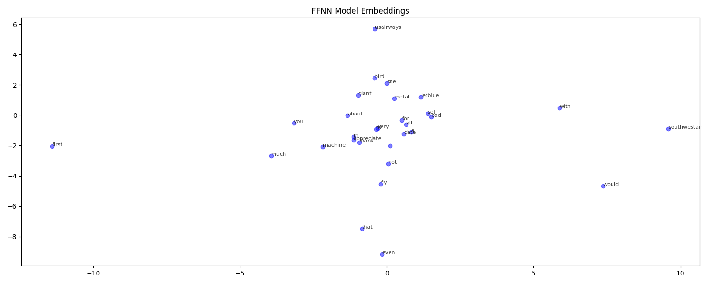

# 🧠 VectorSpeak: Learning Word Meaning with Skip-Gram Word2Vec

This project implements a Skip-Gram model with Negative Sampling using Word2Vec to learn **semantic word embeddings** from airline tweets. It compares two modeling approaches: **Logistic Regression** and a **Feedforward Neural Network (FFNN)**.

---

## ✈️ Project Overview

Natural Language Processing (NLP) models require words to be represented numerically. Word2Vec learns **vector representations** where semantically similar words are mapped closer in space.

This project:
- Preprocesses airline tweet data
- Generates (word, context) training pairs
- Applies **negative sampling**
- Trains two models:
  - **Logistic Regression**
  - **3-layer FFNN**
- Visualizes embeddings using **t-SNE**

---

## 📊 Dataset Summary

A custom airline tweet dataset with binary sentiment labels (positive, negative):

dataset/
├── train/
│ ├── positive/
│ └── negative/
├── test/
│ ├── positive/
│ └── negative/


---

## 🚀 Key Features

| Task                          | Details                                |
|------------------------------|----------------------------------------|
| Corpus                       | Tokenized airline tweets               |
| Training Technique           | Skip-Gram with Negative Sampling       |
| Models Compared              | Logistic Regression vs FFNN            |
| Embedding Visualization      | t-SNE + Matplotlib                     |
| Metrics Reported             | Discrimination Score, Avg Similarity   |

---

## 📈 Results Summary

| Metric                      | Logistic Regression | FFNN        |
|----------------------------|---------------------|-------------|
| Discrimination Score       | 0.0045              | **0.0059**  |
| Avg Positive Similarity    | 0.0046              | **0.0054**  |
| Avg Negative Similarity    | 0.0001              | **-0.0005** |

➡️ **FFNN outperforms** in both semantic grouping and negative contrastive learning.

---
## 🖼️ Visualizations

### 📉 Training Loss Comparison


### 🔠 Embedding Space (Logistic Regression)


### 🧠 Embedding Space (FFNN)


---

## 📂 Files in This Repository

| File Name                         | Description                                 |
|----------------------------------|---------------------------------------------|
| `Word2vec v1.7.ipynb`            | Final notebook implementation               |
| `Report.docx`                    | Full write-up with methodology & results    |
| `word2vec.log`                   | Training log output                         |
| `training_losses.txt`           | Raw loss values for plotting                |
| `logir_evaluation.txt`          | Evaluation of Logistic Regression           |
| `ffnn_evaluation.txt`           | Evaluation of FFNN                          |
| `loss_charts.png`               | Training loss comparison chart              |
| `embeddings_visualization_Logit.png` | t-SNE plot for LogiR embeddings         |
| `embeddings_visualization_FFNN.png`  | t-SNE plot for FFNN embeddings          |

---

## 💻 Tech Stack

```bash
Python 3.x
PyTorch
NumPy
scikit-learn
Matplotlib
t-SNE (from sklearn.manifold)


